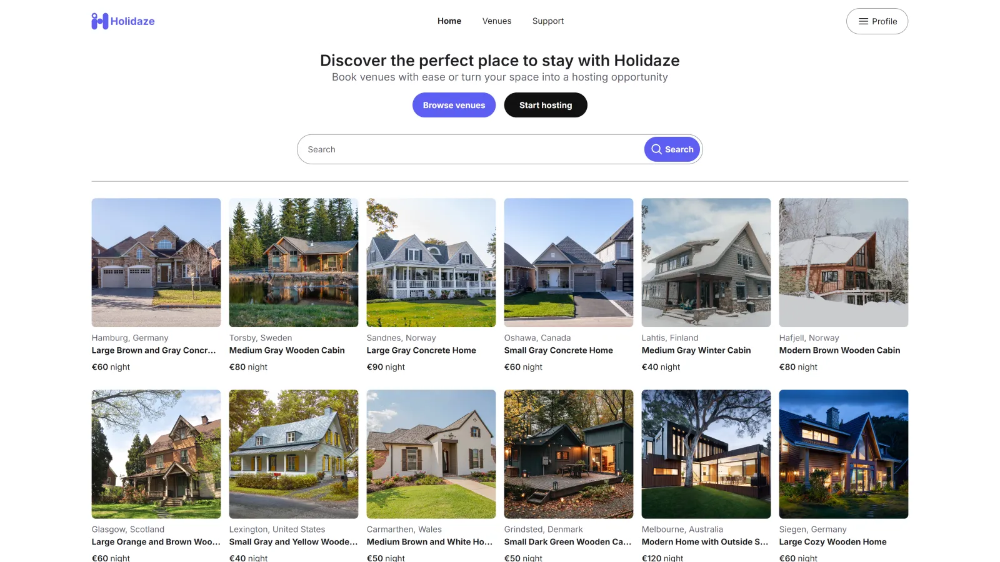

# Project Exam 2



## Description

In this project, you will find a accommodation website with a range of functionalities. Users can view venues, search for specific venues, and view detailed listings for each venue. The website allows users to register an account, log in, and view their upcoming bookings. Additionally, users can host their own venues and manage them through the dashboard. The website is responsive and easy to use on various devices.

**Note:** This is a school project and I do not intend to keep it updated. Feel free to use any inspiration from this project if you want.

## Built with

- [React](https://react.dev/)
- [Tailwind CSS](https://tailwindcss.com/)
- [TypeScript](https://www.typescriptlang.org/)

## Getting started

You can find the live website on [Netlify](https://hyseh-project-exam-2.netlify.app/)

### Installing

1. Clone the repo:

```bash
git clone git@github.com:hyseh/project-exam-2.git
```

2. Install the dependencies:

```bash
npm install
```

### Running

To run the app, run the following commands:

```bash
npm run dev
```

## Contact

You can contact me at [john.hofland@outlook.com](mailto:john.hofland@outlook.com)

## License

This project is open source and available under the [MIT License](LICENSE.md)
